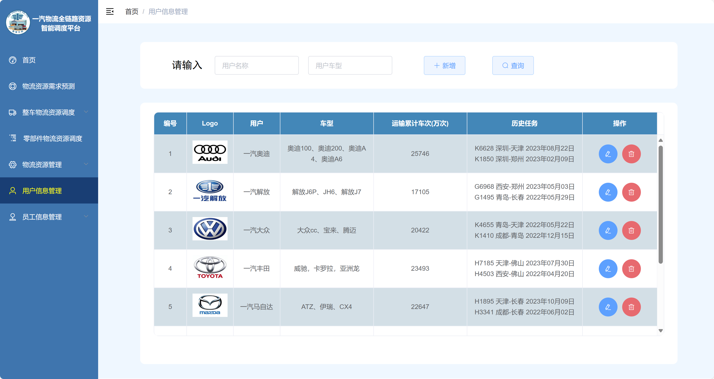

# 一汽物流全链路资源智能调度平台

基于 **PanJiaChen/vue-element-admin** 框架二次开发的前端可视化项目。  

---

## 🚀 项目简介
本项目为长安大学五名物流专业同学的课程设计项目，由本人根据其项目需求独立设计与开发完成，用于物流设计大赛展示。
系统为纯前端实现的物流全链路资源智能调度平台，通过数据可视化与高德地图展示方式，模拟企业级物流运输调度与资源管理流程，涵盖登录系统、可视化统计、高德地图路径规划，以及零部件、物流与员工管理等功能模块。

---

## 🧩 功能模块总览

### 左侧导航栏结构
系统主要包括以下模块：

| 模块名称 | 功能描述 |
|-----------|-----------|
| **首页** | 系统登录后首页仪表盘，展示全局数据概览、实时统计图表等 |
| **物流资源需求预测** | 利用历史数据可视化展示物流需求的年、季、月变化趋势（ECharts 实现） |
| **整车物流资源调度** | 包含运输任务管理、运力匹配查询、物流路径规划（基于高德地图 API） |
| **零部件物流资源调度** | 对零部件运输与资源进行独立管理与可视化展示 |
| **物流资源管理** | 提供设备的查询、修改、新增、删除功能 |
| **用户信息管理** | 管理系统用户信息、权限等基础资料 |
| **员工信息管理** | 员工档案维护、信息查询与修改 |

---

## 📊 部分系统功能展示

### 登录页面


### 首页仪表盘


### 零部件物流资源调度


### 物流路径规划


### 物流资源管理


### 物流路径规划


---

## 🏗️ 技术栈

| 分类 | 技术 |
|------|------|
| 前端框架 | Vue 2.x |
| UI 组件库 | Element UI |
| 可视化库 | ECharts |
| 地图服务 | 高德地图 JavaScript API |
| 状态管理 | Vuex |
| 路由管理 | Vue Router |
| HTTP 请求 | Axios |
| 构建工具 | Vue CLI |
| 基础模板 | vue-element-admin（by PanJiaChen） |

---

## 📂 项目结构

```
vue-admin-template-master
├── build/               # 构建配置
├── dist/                # 打包后文件
├── mock/                # 模拟数据
├── public/              # 公共静态资源
├── src/                 # 核心源码
│   ├── api/             # 模拟接口定义
│   ├── assets/          # 图片、图标
│   ├── components/      # 通用组件
│   ├── layout/          # 页面布局
│   ├── router/          # 路由配置
│   ├── store/           # 状态管理
│   ├── views/           # 各功能页面
│   ├── App.vue          # 根组件
│   └── main.js          # 程序入口
├── package.json         # 依赖与脚本
└── vue.config.js        # Vue CLI 配置
```

---

## ⚙️ 安装与启动

### 1️⃣ 克隆项目
```bash
git clone https://github.com/ChenleWang123/Intelligent-Logistics-Platform.git
cd Intelligent-Logistics-Platform/vue-admin-template-master
```

### 2️⃣ 安装依赖
```bash
npm install
```

### 3️⃣ 启动项目
```bash
npm run dev
```
默认访问地址：
```
http://localhost:9528/
```

### 4️⃣ 构建生产版本
```bash
npm run build
```

---

## 🌐 功能说明

| 功能模块       | 说明                              |
|------------|---------------------------------|
| **登录模块**   | 纯前端登录验证（默认账号：admin / 密码：111111） |
| **可视化展示**  | ECharts 实现动态柱状图、折线图             |
| **地图路径规划** | 调用高德地图 API，实现物流线路可视化与路径规划       |
| **设备/员工管理** | 支持设备信息的增删改查，模拟后台交互              |
| **用户管理** | 支持信息维护、查询                       |

---

## 💡 项目亮点

- **纯前端实现**：无需后端环境即可完整展示功能；
- **地图与可视化结合**：物流路径与数据图表一体化展示；
- **模块化结构**：清晰可维护，便于扩展；
- **交互友好**：基于 Element UI 的简洁界面；
- **高校项目实用模板**：适合物流/管理类毕业设计与课程项目展示。

---

## 📜 致谢

- [PanJiaChen/vue-element-admin](https://github.com/PanJiaChen/vue-element-admin)：提供优秀的前端架构模板
- 高德地图开放平台：提供强大的地图服务接口

---
## 🪪 License

本项目基于 [MIT License](./LICENSE) 开源，  
仅供学习与研究使用，禁止未经授权的商业用途。
