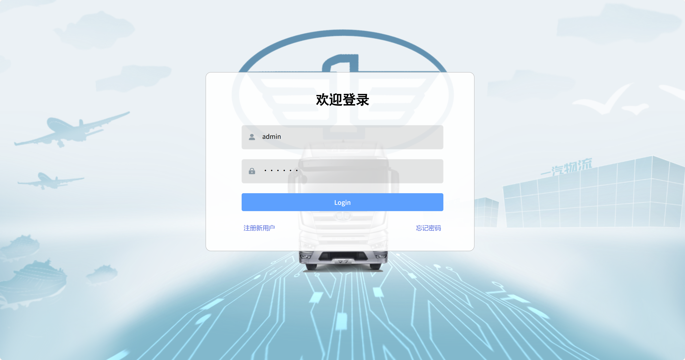
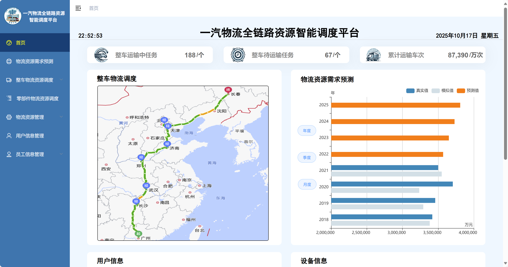
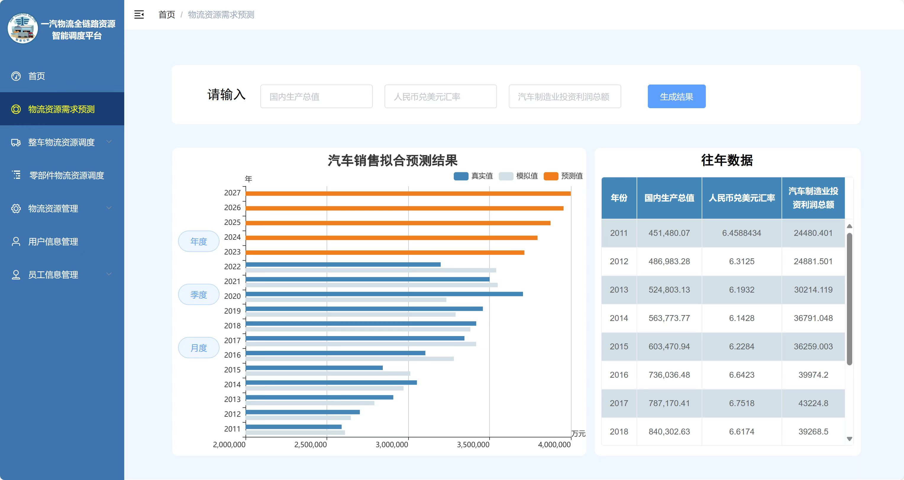
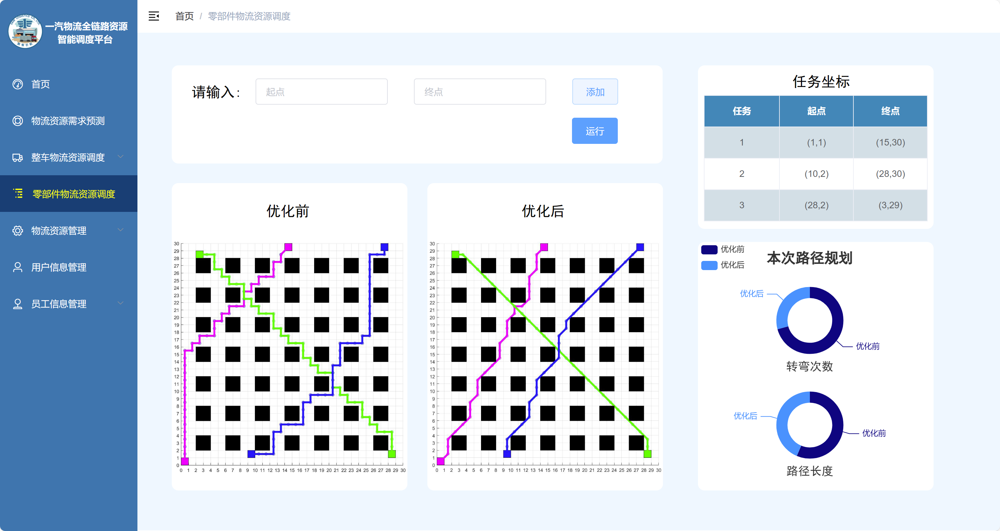
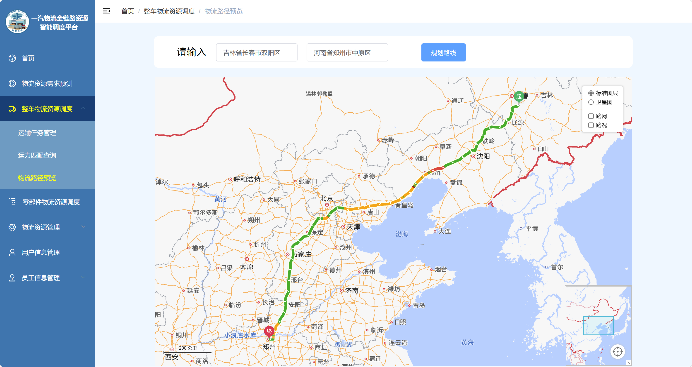
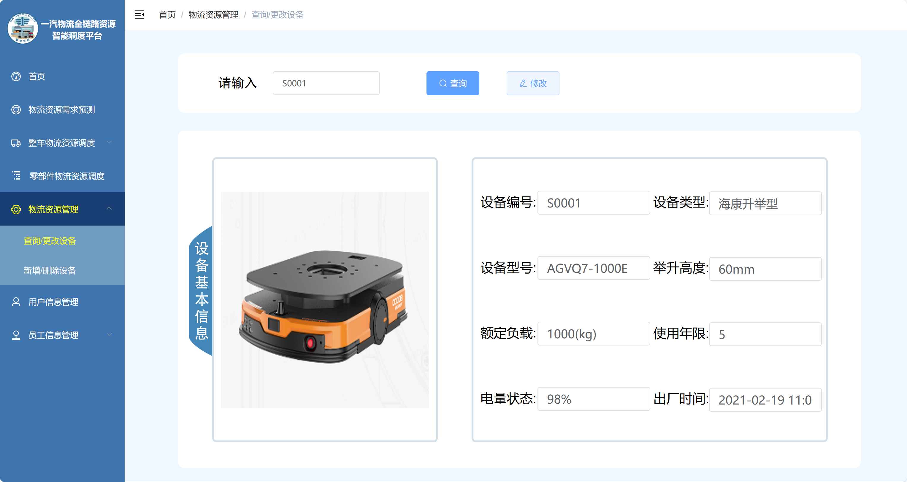
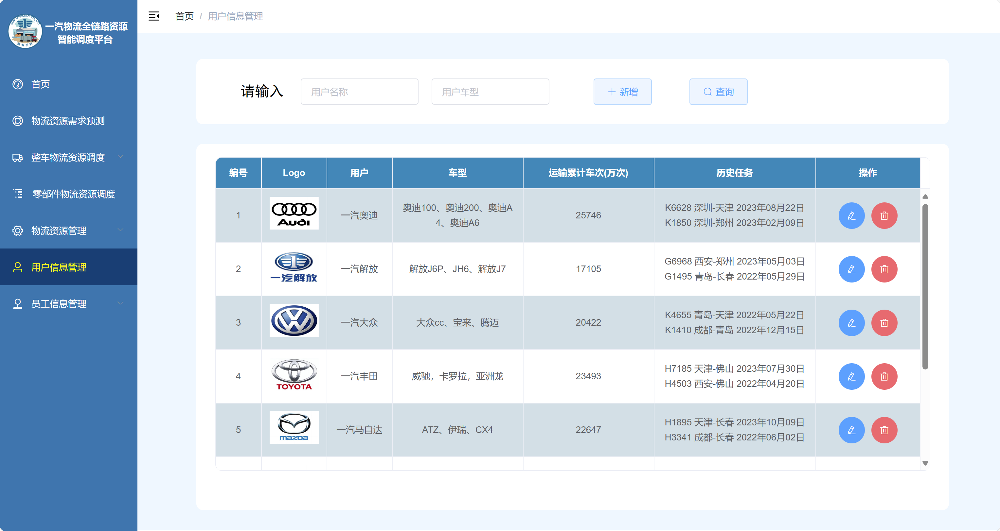

# Intelligent Logistics Resource Scheduling Platform

A front-end visualization project developed based on **PanJiaChen/vue-element-admin** framework.

---

## 🚀 Project Overview
This project was commissioned by five logistics students from Chang'an University as part of their course design project. It was independently designed and developed by Chenle Wang according to their requirements, and used for the Logistics Design Competition demonstration.  
The system is a **pure front-end logistics resource scheduling platform**, which simulates enterprise-level logistics operations and resource management through data visualization and AMap integration. It includes modules for login, data dashboards, route planning, and management of parts, logistics, and staff information.

---

## 🧩 Module Overview

### Sidebar Navigation Structure
The system includes the following main modules:

| Module | Description |
|-----------|-------------|
| **Home** | Dashboard after login, displaying overall data overview and real-time charts |
| **Logistics Demand Forecast** | Visualizes annual, quarterly, and monthly logistics demand trends (powered by ECharts) |
| **Vehicle Logistics Scheduling** | Includes transport task management, capacity matching, and route planning (based on AMap API) |
| **Parts Logistics Scheduling** | Independent visualization and management for parts logistics resources |
| **Logistics Resource Management** | Provides CRUD functions for equipment information |
| **User Information Management** | Manages user information and permissions |
| **Staff Information Management** | Maintains employee records and modification features |

---

## 📊 System Demonstration

### Login Page


### Dashboard


### Demand Forecast


### Parts Logistics Scheduling


### Route Planning


### Equipment Management


### User Management


---

## 🏗️ Tech Stack

| Category | Technology |
|-----------|-------------|
| Front-end Framework | Vue 2.x |
| UI Library | Element UI |
| Visualization | ECharts |
| Map Service | AMap JavaScript API |
| State Management | Vuex |
| Routing | Vue Router |
| HTTP Requests | Axios |
| Build Tool | Vue CLI |
| Base Template | vue-element-admin (by PanJiaChen) |

---

## 📂 Project Structure

```
vue-admin-template-master
├── build/               # Build configuration
├── dist/                # Production output
├── mock/                # Mock data
├── public/              # Static assets
├── src/                 # Source code
│   ├── api/             # API definitions
│   ├── assets/          # Images and icons
│   ├── components/      # Reusable components
│   ├── layout/          # Page layout
│   ├── router/          # Routing configuration
│   ├── store/           # Vuex state management
│   ├── views/           # Application pages
│   ├── App.vue          # Root component
│   └── main.js          # Entry point
├── package.json         # Dependencies and scripts
└── vue.config.js        # Vue CLI configuration
```

---

## ⚙️ Installation and Startup

### 1️⃣ Clone the Project
```bash
git clone https://github.com/ChenleWang123/Intelligent-Logistics-Platform.git
cd Intelligent-Logistics-Platform/vue-admin-template-master
```

### 2️⃣ Install Dependencies
```bash
npm install
```

### 3️⃣ Run the Project
```bash
npm run dev
```
Default access URL:
```
http://localhost:9528/
```

### 4️⃣ Build for Production
```bash
npm run build
```

---

## 🌐 Feature Description

| Module | Description |
|---------|-------------|
| **Login Module** | Front-end only authentication (default: admin / 111111) |
| **Data Visualization** | Dynamic bar and line charts powered by ECharts |
| **Route Planning** | Uses AMap API for route visualization and planning |
| **Equipment/Staff Management** | CRUD operations with simulated backend interaction |
| **User Management** | Basic user information and query features |

---

## 💡 Highlights

- **Pure Front-end Implementation**: Works without any backend dependency
- **Visualization + Mapping Integration**: Combines logistics routes with data charts
- **Modular Architecture**: Clean and extendable structure
- **User-Friendly UI**: Built with Element UI components
- **Academic-Grade Template**: Ideal for logistics or management-related graduation and design projects

---

## 📜 Acknowledgements

- [PanJiaChen/vue-element-admin](https://github.com/PanJiaChen/vue-element-admin): Excellent front-end architecture template
- AMap Open Platform: Powerful map visualization and routing API

---

## 🪪 License

This project is released under the [MIT License](./LICENSE).  
For educational and research purposes only. Commercial use without authorization is prohibited.
